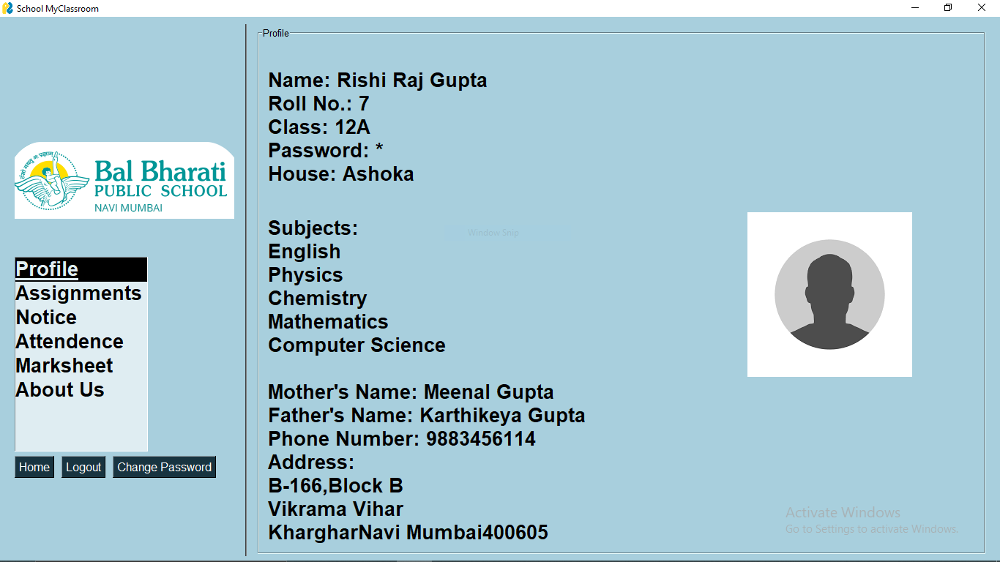
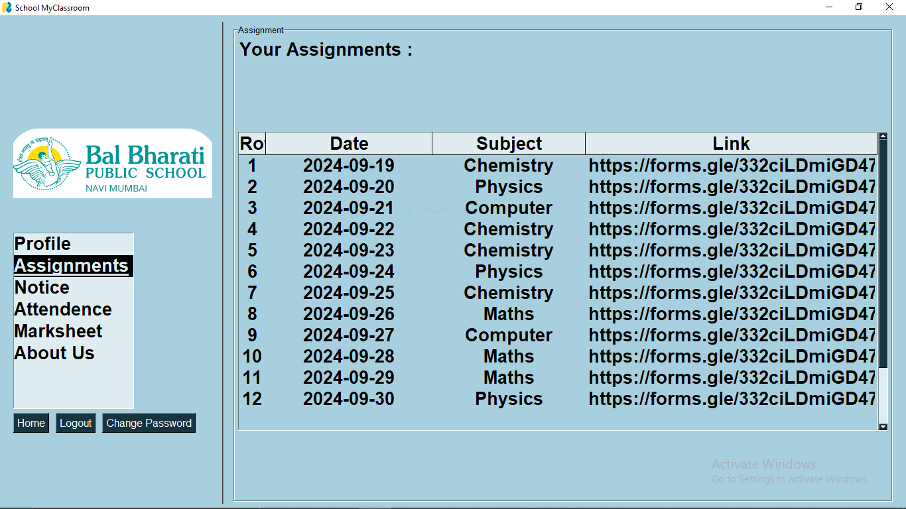
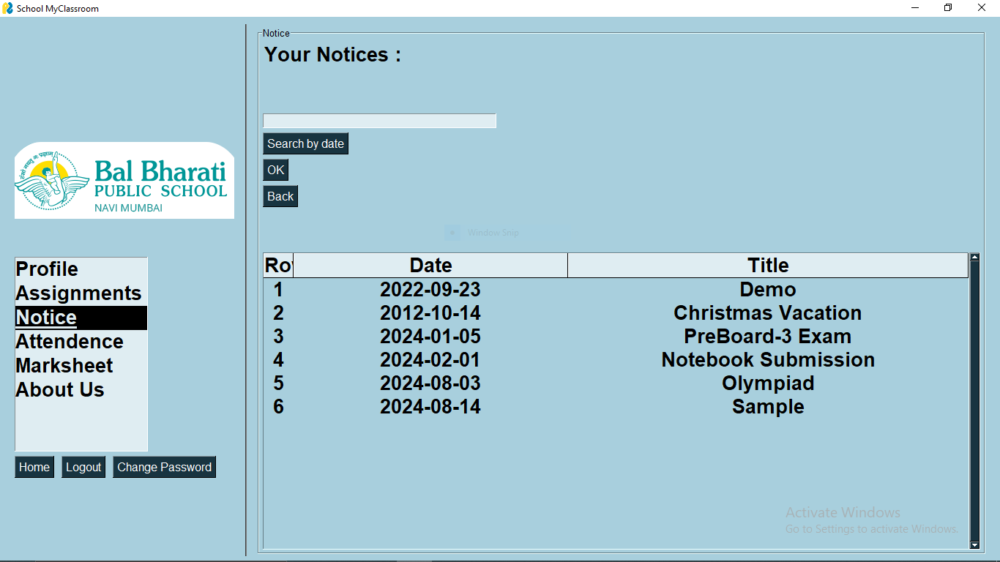
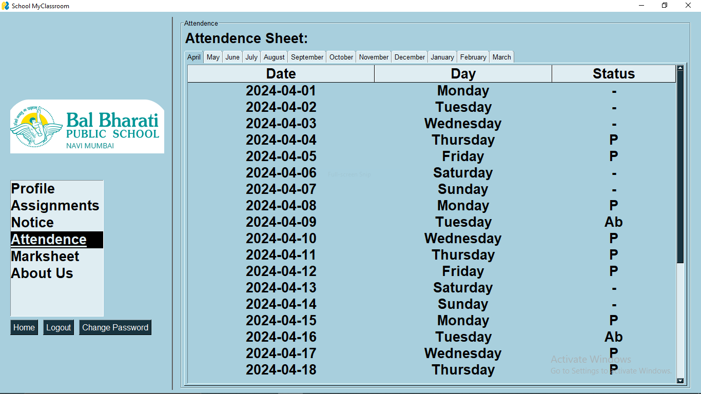
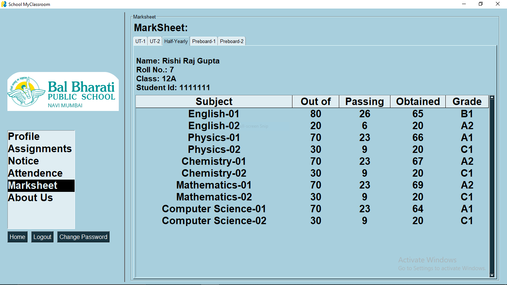
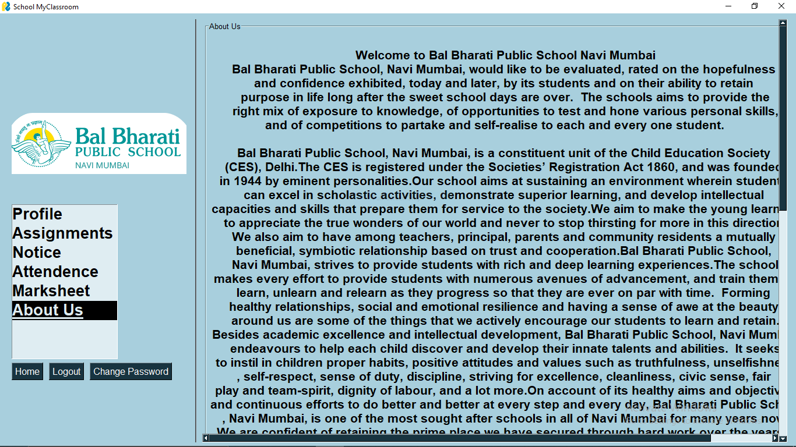
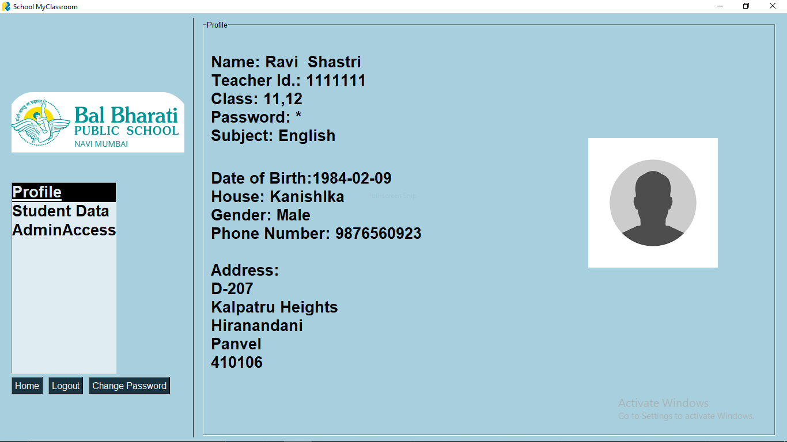
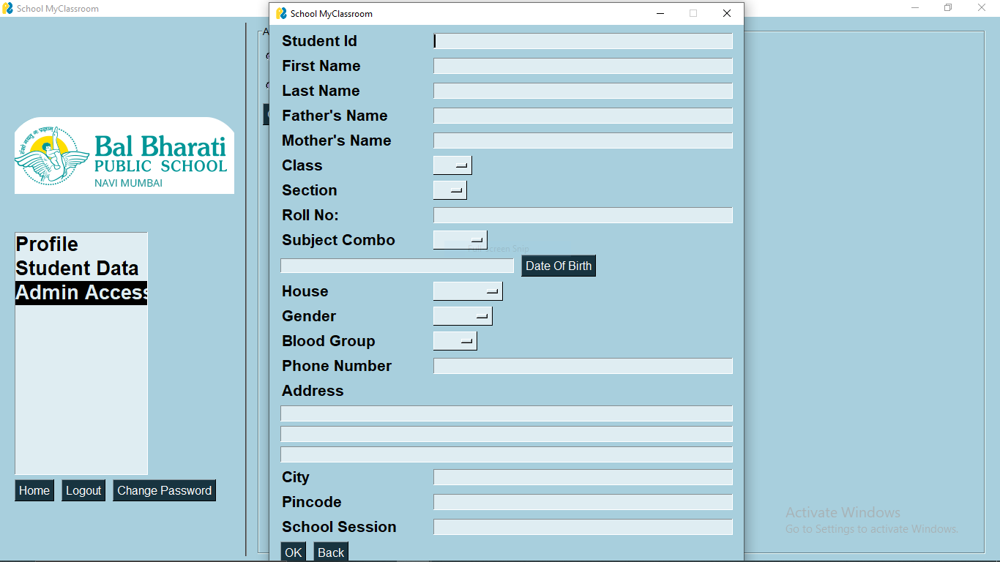
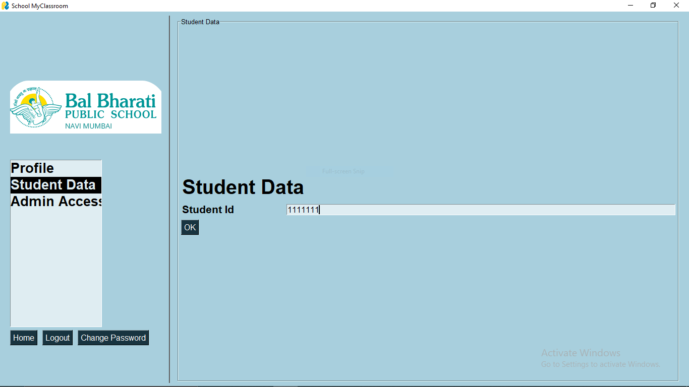
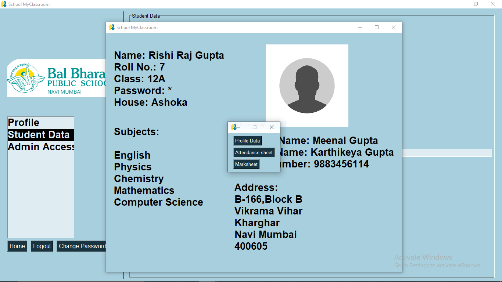

# Scholarly Connect
An MCB management system implemented using python, MySQL database and python based GUI

Scholarly Connect is a basic version
of School Management Software
inspired from Google Classroom. It helps
to maintain student and teacher records in
a feasible and user friendly way. In
addition to the assignment function
supported by Google Classroom, the
software also provides additional features
such as Notices, Announcements Mark
sheet and so on. The software is designed
to automate, streamline and integrate
everyday functions of the school.

